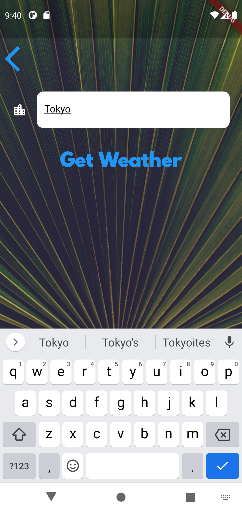

# <center> Clima Flutter </center>

<center>
[](https://codecov.io/gh/gomesdavid/ClimaFlutter)
</center>

---

<p> This <b>Clima</b> project was created in flutter using the <a href="https://github.com/felangel/bloc">BLoC package</a>, with all widgets, features and bloc <a href="https://app.codecov.io/gh/gomesdavid/ClimaFlutter">tested using codecov</a>. </p>

---

### What It Is

<p>This app gives the weather of <b>your current location</b> and also lets you search the weather of <b>any city in the world.</b></p>

---

### Examples

<table>
    <tr>
        <td>
        
        </td>
        <td>
                
        </td>
        <td>
        
        </td>
    </tr>
</table>

---

### State Management With BLoC

#### Weather bloc

```dart
class WeatherBloc extends Bloc<WeatherEvent, WeatherState> {
  WeatherBloc({@required WeatherRepository weatherRepository})
      : assert(weatherRepository != null),
        _weatherRepository = weatherRepository,
        super(WeatherInitial());

  final WeatherRepository _weatherRepository;

  @override
  Stream<WeatherState> mapEventToState(
    WeatherEvent event,
  ) async* {
    if (event is GetLocalWeather) {
      yield* _localWeatherChangedToState();
    } else if (event is GetCityWeather) {
      yield* _cityWeatherChangedToState(event.cityName);
    }
  }

  Stream<WeatherState> _localWeatherChangedToState() async* {
    yield WeatherLoading();
    try {
      final weather = await _weatherRepository.getLocationWeather();
      yield WeatherLoaded(weatherModel: weather);
    } catch (e) {
      yield WeatherLoadingFail();
    }
  }

  Stream<WeatherState> _cityWeatherChangedToState(String cityName) async* {
    yield WeatherLoading();
    try {
      final cityWeather = await _weatherRepository.getCityWeather(cityName);
      yield WeatherLoaded(weatherModel: cityWeather);
    } catch (e) {
      yield WeatherLoadingFail();
    }
  }
}
```

---

### How to Use

**Step 1:**
Download or clone this repo by using the link below:

```
https://github.com/gomesdavid/ClimaFlutter.git
```

**Step 2:**

Go to project root and execute the following command in the console to get the required dependencies:

```
flutter pub get
```

**Step 3:**

Run the project.

---